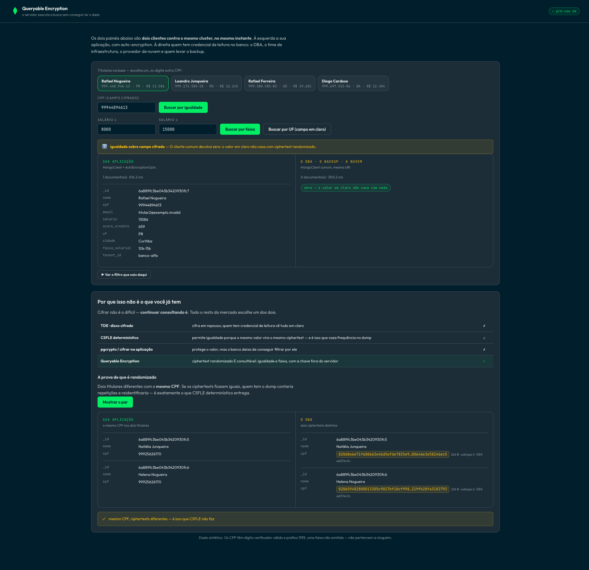

# Query data the server cannot read

[](https://github.com/adrianofratelli-glitch/atlas-queryable-encryption/actions/workflows/ci.yml)

Who can read customer identifiers in a conventional data platform? Frequently,
the answer includes database administrators, infrastructure teams, backup
operators, and the cloud provider. Encryption at rest and in transit does not
change that boundary: the database still decrypts the value to process it.

**MongoDB Queryable Encryption** encrypts a field with a customer-controlled key
while preserving equality and range queries. The server never sees plaintext at
rest, in transit, in use, in logs, or in backups.

This public overview is in English; the PoV interface and presentation-specific
documentation remain in Brazilian Portuguese.

## The PoV

One screen sends the same filter through **two clients against the same
collection**: an application client with automatic encryption and a regular
client representing the database administrator's view.

The encrypted application client finds the document and reads the identifier.
The regular client receives `Binary(subtype 6)` and finds **zero documents** when
filtering by the same plaintext value.



Three actions address the core objections:

| Action | What it proves |
|---|---|
| **Equality query** | A filter over an encrypted field works without deterministic ciphertext |
| **Range query** | `$gte`/`$lte` work over an encrypted field; range queries are GA in MongoDB 8.0 |
| **State query** | The experimental control: both clients find the same plaintext field |

The **Show pair** action displays two different customers with the same
identifier and different ciphertexts. That distinction matters: identical
ciphertexts would let anyone holding a dump count repetitions and infer identity.

## How it differs from familiar controls

| Approach | Security and query behavior |
|---|---|
| TDE or encrypted disks | Protect data at rest; users with read credentials still see plaintext |
| Deterministic CSFLE | Enables equality because equal values produce equal ciphertext, which leaks frequency |
| `pgcrypto` or application encryption | Protects the value but removes the database's ability to filter it |
| **Queryable Encryption** | **Randomized, queryable ciphertext for equality and range, with keys outside the server** |

## Requirements

- MongoDB 7.0+ on Atlas M10 or above. Flex and free tiers are not supported.
  Range queries are generally available starting in MongoDB 8.0.
- Python 3.11+ and Node.js 20+.
- A KMS provider: local key file for the demo or AWS KMS for production.

## Setup

```bash
# Backend
cd backend
python -m venv venv && source venv/bin/activate
pip install -r requirements-dev.txt
cp .env.example .env        # set MONGO_URI
cd ..

# Master key and crypt_shared library
python scripts/gerar-master-key.py     # 96 bytes in backend/secrets/, mode 0600
./scripts/instalar-crypt-shared.sh     # library → backend/lib/

# Key vault and data
python scripts/criar-cofre.py          # key-vault index and demo DEKs
python backend/seed_data.py            # 5,000 encrypted synthetic customers

# Frontend
cd frontend && npm install && cd ..
```

## Run it

```bash
./start.sh --foreground     # backend :8300 + frontend :5300
curl http://localhost:8300/preflight
```

The preflight checks `MONGO_URI`, cluster reachability, server version,
`crypt_shared`, the key vault, the collection, and the mutation-guard mode. This
prevents an incompatible server version from surfacing only as an unrelated
"unknown command" error.

## How it works

```text
React (frontend/, :5300) ──fetch──> FastAPI (backend/, :8300)
                                        │
                                        ├── ENCRYPTED MongoClient (AutoEncryptionOpts) ──> Atlas
                                        ├── REGULAR MongoClient (the DBA view)          ──> Atlas
                                        └── Local KMS or AWS KMS
```

The two clients in `backend/encryption.py` are the experiment, not an
implementation detail: the split UI renders their results side by side.

There is only one business collection. Both panels read `clientes`; only the
client changes. The adjacent `enxcol_.*` collections contain server-maintained
metadata that supports matching without revealing the values.

The driver encrypts the query value with the same DEK and sends ciphertext.
Plaintext never crosses the network.

## Tests

```bash
pytest                 # no cluster, crypt_shared, or KMS required
ruff check backend scripts
```

Every pull request runs the backend test suite, Ruff, and a dependency audit,
plus a clean frontend production build and npm audit. The suite uses MongoDB
stubs and requires no Atlas cluster, `crypt_shared` library, or KMS provider.

## Security boundaries

- The local master key is stored under `backend/secrets/` with mode `0600`, not
  in `.env`, and is excluded from version control. Local KMS is for demonstration;
  production deployments should use AWS KMS, Azure Key Vault, GCP KMS, or KMIP.
- No endpoint returns the master key, a decrypted DEK, or complete `keyMaterial`.
- Never point this PoV at anything other than a disposable demonstration cluster.
- The dataset is synthetic. Identifiers have valid check digits and use the
  non-issued `999` prefix; they do not belong to real people.

## License

MIT.
