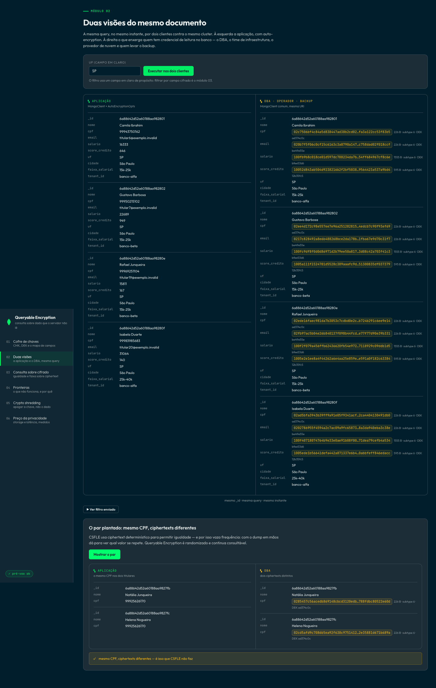
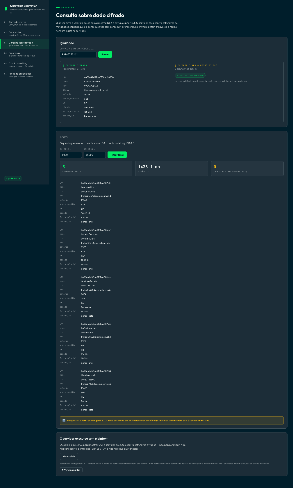
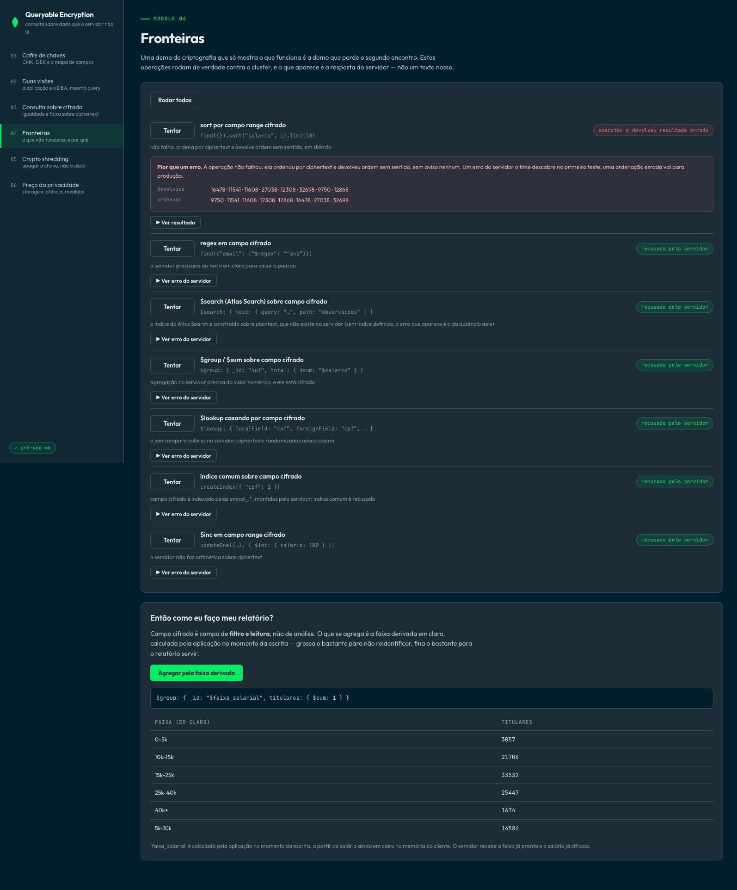
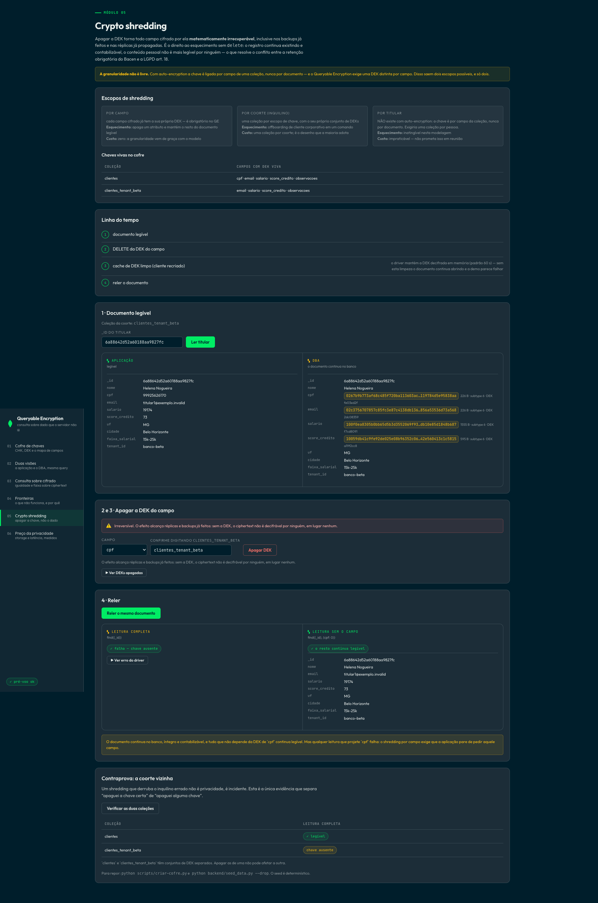
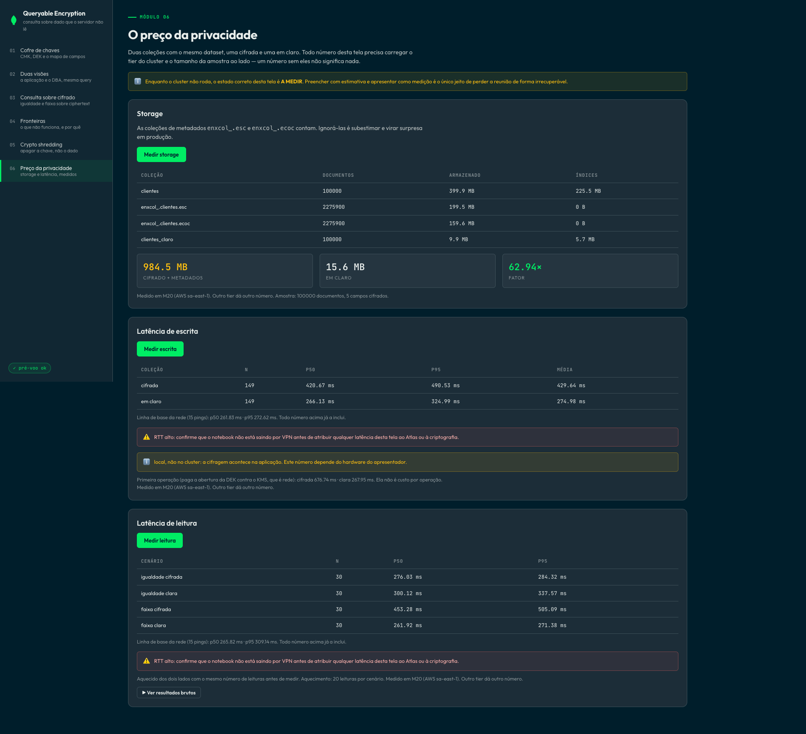

# Consulta sobre dado que o servidor não consegue ler

Quem no seu time consegue ler o CPF dos seus clientes hoje? Na maioria das arquiteturas a
resposta é: o DBA, o time de infraestrutura, quem tem acesso ao backup e o provedor de nuvem.
Criptografia em repouso e em trânsito não muda isso — nos dois casos o banco decifra para
poder trabalhar.

Esta PoV mostra o **MongoDB Queryable Encryption** contra um cluster real: campos cifrados com
chave do cliente, que continuam sendo filtrados por igualdade e por faixa, sem que o servidor
veja plaintext em momento algum — nem em repouso, nem em trânsito, nem em uso, nem no log, nem
no backup.

> **Queryable Encryption, não CSFLE.** CSFLE (2019) consulta campo cifrado de forma
> determinística: o mesmo valor produz sempre o mesmo ciphertext, o que permite igualdade e
> vaza frequência — com o dump em mãos dá para ver qual valor se repete. Queryable Encryption
> é randomizado e continua consultável, por igualdade e por faixa.

---

## A demo

### 1. Duas visões do mesmo documento

A mesma query, no mesmo instante, por dois clientes contra o mesmo cluster. À esquerda a
aplicação, com auto-encryption. À direita o que enxerga quem tem credencial de leitura no banco.
Mesmos `_id`, mesmos campos em claro, campos sensíveis como `Binary(subtype 6)`.

O par destacado tem o **mesmo CPF nos dois titulares e ciphertexts diferentes** — é o que CSFLE
não faz.

<!--  -->

### 2. Igualdade e faixa sobre ciphertext

O driver cifra o valor da busca e envia o ciphertext; o servidor casa contra estruturas de
metadados cifradas que ele consegue usar sem conseguir interpretar. Ao lado, o mesmo filtro pelo
cliente comum retornando **zero documentos** — o valor em claro não casa com nada.

<!--  -->

### 3. As fronteiras, ditas antes de o cliente descobrir sozinho

`sort`, `regex`, `$search`, `$group`, `$lookup`, índice comum e `$inc` sobre campo cifrado.
Cada tentativa roda de verdade e mostra o erro do servidor. E, no fim da página, a modelagem
alternativa — um campo de faixa derivado em claro ao lado do valor cifrado — que é a resposta,
não o consolo.

<!--  -->

### 4. Crypto shredding

Apagar a DEK torna todo campo cifrado por ela matematicamente irrecuperável, inclusive nos
backups já feitos e nas réplicas já propagadas. O registro continua existindo e contabilizável;
o conteúdo pessoal não é mais legível por ninguém — LGPD art. 18 sem conflito com a retenção
obrigatória do Bacen.

<!--  -->

### 5. O preço

Storage e latência das duas coleções, com as coleções de metadados `enxcol_.*` contadas junto.
Todo número carrega o tier do cluster e o tamanho da amostra ao lado.

<!--  -->

---

## Requisitos

- **MongoDB 7.0+**, no Atlas **M10 ou superior**. Não roda em Flex nem no tier gratuito.
  Consulta por faixa é GA a partir do **8.0**.
- Python 3.11+, Node 20+.
- Um provedor de KMS: arquivo local (demo) ou AWS KMS (produção).

## Setup

```bash
# Backend
cd backend
python -m venv venv && source venv/bin/activate
pip install -r requirements-dev.txt
cp .env.example .env        # preencha MONGO_URI
cd ..

# Chave mestra e biblioteca de criptografia
python scripts/gerar-master-key.py     # 96 bytes em backend/secrets/, modo 0600
./scripts/instalar-crypt-shared.sh     # biblioteca → backend/lib/

# Cofre e dados
python scripts/criar-cofre.py          # índice do keyVault + as DEKs da demo
python backend/seed_data.py            # 5.000 titulares nas duas coleções

# Frontend
cd frontend && npm install && cd ..
```

## Executar

```bash
./start.sh --foreground     # backend :8300 + frontend :5300
curl http://localhost:8300/preflight
```

O preflight checa `MONGO_URI`, alcance do cluster, versão do servidor, presença da
`crypt_shared`, o cofre, as duas coleções e o modo da guarda de mutação.

## Testes

```bash
pytest                        # 32 testes, nenhum precisa de cluster
ruff check backend scripts
```

## Segurança

- A chave mestra local **não fica no `.env`**: fica em `backend/secrets/`, com modo 0600, fora
  do controle de versão. KMS local é para demonstração — em produção use AWS KMS, Azure Key
  Vault, GCP KMS ou KMIP.
- Nenhum endpoint devolve chave mestra, DEK decifrada ou `keyMaterial` completo.
- Vários endpoints são destrutivos por natureza (apagar DEK, dropar coleção). **Nunca aponte
  esta PoV para nada além de um cluster de demonstração descartável.**
- O dataset é sintético. Os CPF têm dígito verificador válido e prefixo `999`, uma faixa não
  emitida: eles não pertencem a ninguém.

## Licença

MIT.
